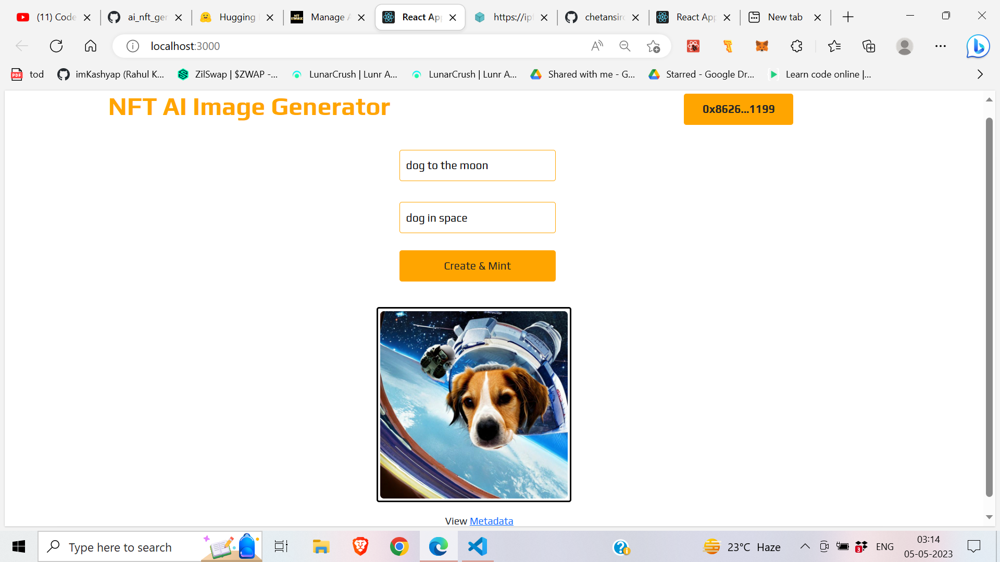
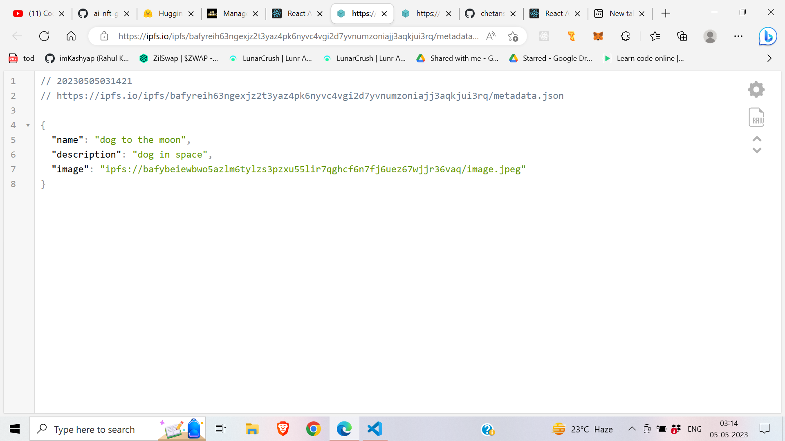

# 🤖 NFT AI Image Generator 🤖

This is a NFT-AI image generator website.   
Where you can genrate image of your imagination.  
Just by giving name and description you can mint that image and view metadata of the NFT.

## Project Explaination -> 
 
<b> 1. First local run hardhat node and connect your metamask wallet with coonect button in the website </b>
    
<b> 2. Fill the NFT name and Description of the AI Image</b>     
 
<b> 3. To genrate click on create and mint button ,the metamask wallet will open and click on allow transcation <b>
   
 

 
<b> 4. Now click on View Metadata to view medata of the AI Genrated NFT 😍 </b>
  
 

## Technology Stack & Tools

- Solidity (Writing Smart Contracts & Tests)
- Javascript (React & Testing)
- [Hardhat](https://hardhat.org/) (Development Framework)
- [Ethers.js](https://docs.ethers.io/v5/) (Blockchain Interaction)
- [React.js](https://reactjs.org/) (Frontend Framework)
- [NFT.Storage](https://nft.storage/) (Connection to IPFS)
- [Hugging Face](https://huggingface.co/) (AI Models)

## Requirements For Initial Setup
- Install [NodeJS](https://nodejs.org/en/)

## Setting Up
### 1. Clone/Download the Repository
git clone https://github.com/ashpreetsinghanand/NFT-AI-Image-Generator.git </b>
### 2. Install Dependencies:
`$ npm install`

### 3. Setup .env file:
Before running any scripts, you'll want to create a .env file with the following values (see .env.example):

- **REACT_APP_HUGGING_FACE_API_KEY=""**
- **REACT_APP_NFT_STORAGE_API_KEY=""**

You'll need to create an account on [Hugging Face](https://huggingface.co/), visit your profile settings, and create a read access token. 

You'll also need to create an account on [NFT.Storage](https://nft.storage/), and create a new API key.

### 4. Run tests
`$ npx hardhat test`

### 5. Start Hardhat node
`$ npx hardhat node`

### 6. Run deployment script
In a separate terminal execute:
`$ npx hardhat run ./scripts/deploy.js --network localhost`

### 7. Start frontend
`$ npm run start`
